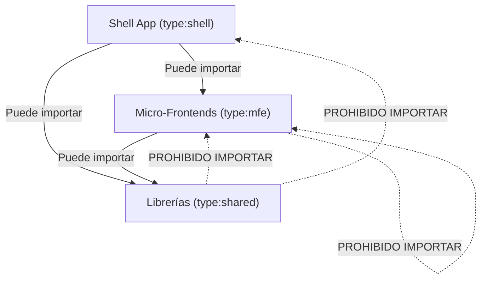

# The Tractor Store - Arquitectura Micro-Frontends

Este proyecto es una implementación completa de un e-commerce a gran escala utilizando una arquitectura de **Micro-Frontends** en el Frontend (Angular 19 + Module Federation) y un **Monolito Modular** en el Backend (Spring Boot 3).

## 🗺️ División de Dominios (Equipos Autónomos)

Para evitar que el código se convierta en un "monstruo" inmanejable, el sistema se divide en tres equipos independientes:

### 1. Team Explore (Descubrimiento)
- **Responsabilidad:** Atraer al usuario y ayudarle a encontrar el tractor ideal.
- **Componentes/Páginas:** Página de inicio (Home), listado de productos, filtros de búsqueda y recomendaciones personalizadas.
- **Impacto en el negocio:** Conversión inicial y retención de tráfico.

### 2. Team Decide (Decisión)
- **Responsabilidad:** Convencer al usuario y clarificar los detalles técnicos del producto.
- **Componentes/Páginas:** Página de detalle del producto (PDP), selector de variantes (color, potencia, accesorios), y validación de stock en tiempo real.
- **Impacto en el negocio:** Asegurar la intención de compra reduciendo la incertidumbre del cliente.

### 3. Team Checkout (Transacción)
- **Responsabilidad:** Garantizar que el dinero entre al negocio de forma segura y fluida.
- **Componentes/Páginas:** Botón de "Añadir al carrito", mini-carrito flotante, página del carrito, pasarela de pago y confirmación de orden.
- **Impacto en el negocio:** Reducción del abandono del carrito y procesamiento transaccional seguro.

---
## 🛠️ Stack Tecnológico
- **Frontend:** Angular 19 (Signals), Nx Monorepo, TailwindCSS, Module Federation.
- **Backend:** Java 21, Spring Boot 3 (Spring Modulith), PostgreSQL.
- **Calidad/Ops:** GitHub Actions, Jest, Playwright, SonarCloud.


---
¿Qué es pnpm y por qué es obligatorio en proyectos grandes?
Piensa en cómo funciona npm tradicional: si tienes 10 proyectos en tu computadora que usan React o Angular, npm descarga los mismos archivos pesados 10 veces en 10 carpetas node_modules diferentes. Es lento y devora tu disco duro.

pnpm (Performant NPM) resuelve esto de una forma brillante:

Un único almacén global: Descarga la librería una sola vez en una ubicación secreta de tu disco duro.

Enlaces simbólicos (Symlinks): En la carpeta node_modules de tu proyecto, pnpm no copia los archivos, sino que crea un "acceso directo" (symlink) que apunta a ese almacén global.

¿Por qué lo usamos en el Tractor Store?
Porque en la Fase 3 crearemos un Monorepo con Nx. Tendremos 3 aplicaciones (Explore, Decide, Checkout) viviendo juntas. pnpm es el estándar de la industria para monorepos porque enlaza las dependencias entre aplicaciones internamente a la velocidad del rayo, evitando conflictos de versiones.

Por ahora, solo necesitas saber que los comandos son casi idénticos: en lugar de npm install, usarás pnpm install. ¡Eso es todo!


¿Por qué necesitas NVM?
Durante el desarrollo con Node.js, diferentes proyectos pueden requerir diferentes versiones de Node.js. Por ejemplo:

Algunos proyectos más antiguos pueden no ser compatibles con la última versión de Node.js
Puede que necesites probar el rendimiento de tu aplicación bajo diferentes versiones de Node.js
Algunos paquetes npm pueden soportar solo versiones específicas de Node.js
El uso de NVM resuelve los problemas de incompatibilidad entre varias versiones de Node.js, permitiendo a los desarrolladores cambiar rápidamente de entorno según los requisitos del proyecto.  [text](https://www.nvmnode.com/es/guide/introduction.html)


¡Qué excelente captura de pantalla! Ver ese `#shadow-root (open)` en tus herramientas de desarrollador es un momento clave. Es la prueba visual de que la teoría está funcionando en la práctica.

Es completamente normal que estos tres conceptos te generen confusión. Son conceptos avanzados de JavaScript puro, y la guía advierte explícitamente que entender cómo un evento atraviesa la frontera del Shadow DOM es crítico para que nuestros micro-frontends se comuniquen sin fallos.

Vamos a desmitificarlos uno por uno con analogías sencillas, como si estuviéramos frente a una pizarra.

---

### 1. El DOM y el Shadow DOM

Imagina que una página web es un **árbol genealógico**. El **DOM** (Document Object Model) es simplemente la forma en que el navegador lee tu código HTML y lo convierte en ese árbol de elementos vivos en la memoria (donde el `<body>` es padre del `<h1>`, que a su vez es hermano del `<button>`).

El gran problema del DOM normal es que es **público y global**. Si un equipo escribe una regla CSS para los botones, afectará a *todos* los botones del árbol (como te pasó con el botón azul y feo de la prueba).

Aquí nace el **Shadow DOM** (DOM en la sombra). Piensa en él como una "habitación insonorizada" incrustada dentro de ese árbol.

* **Aislamiento total:** Lo que pasa en el Shadow DOM, se queda en el Shadow DOM. El CSS global del documento no puede entrar a ensuciar tu diseño, y tus estilos no pueden salir a romper el resto de la página.


* Por eso tu `<tractor-button>` mantuvo su color rojo corporativo a pesar del código malicioso de arriba.

---

### 2. CustomEvent (El Mensajero con Mochila)

En JavaScript, los eventos tradicionales (como un `click` o un `mousemove`) son mensajeros muy básicos. Solo gritan: *"¡Ey, me hicieron clic!"*.

Pero en una arquitectura como The Tractor Store, necesitamos más que eso. Si un usuario está en la página de producto (Team Decide) y hace clic en "Añadir", el carrito (Team Checkout) necesita saber *qué* producto añadir y en qué *cantidad*.

Un **`CustomEvent`** es un evento especial al que le puedes poner una "mochila con datos" utilizando la propiedad `detail`.

```javascript
// El mensajero lleva el ID del producto en su propiedad "detail"
const evento = new CustomEvent('carrito:actualizado', {
  detail: { sku: 'TRACTOR-5000', cantidad: 1 }
});

```

---

### 3. La propiedad `composed` (El Pasaporte VIP)

Aquí es donde los dos conceptos anteriores chocan. Recuerda que el Shadow DOM es una habitación insonorizada.

Por defecto, si un evento nace *adentro* de esa habitación (como el clic en tu botón rojo) e intenta salir para avisarle al resto de la página, **choca contra la pared del Shadow DOM y es bloqueado**. El navegador asume que todo lo de adentro es privado.

Para solucionar esto, al crear nuestro `CustomEvent`, le añadimos la propiedad `composed: true`.

* **El Pasaporte:** Poner `composed: true` es darle un pasaporte diplomático al evento. Le dice al navegador: *"Permite que este evento atraviese la frontera del Shadow DOM y viaje hacia arriba por el DOM normal para que cualquier otro equipo pueda escucharlo"*.


---

### El resumen de lo que viste en tu pantalla

Cuando hiciste clic en el botón rojo en tu navegador ocurrió esta coreografía exacta:

1. Hiciste clic dentro de una zona protegida (**Shadow DOM**).
2. Se creó un mensajero personalizado (**CustomEvent**).
3. Gracias a que le dimos su pasaporte (**composed: true**), el evento logró salir de la zona protegida, llegó al `index.html` principal, y por eso se ejecutó el `alert()` que programamos.

¡Excelente! Esa es la actitud correcta. La ingeniería se trata de entender primero el terreno antes de construir el edificio.

Vamos a hacer un "Checkpoint" rápido para asegurarnos de que la base teórica sea sólida antes de volver a tocar código. Piensa en esto como revisar los cimientos de una casa:

**1. DOM vs Shadow DOM**
* **La analogía:** Imagina el DOM como una casa con muchas habitaciones. El Shadow DOM es como si metiéramos una habitación "insonorizada" dentro de otra.
* **Tu experiencia:** Cuando escribiste tu botón rojo, este quedó dentro de la "habitación Shadow". El código malicioso de `body * { background: blue !important; }` solo afecta al pasillo (DOM normal), pero no puede entrar a la habitación cerrada (Shadow DOM) para pintar el botón de azul.
* **¿Correcto?** Exacto. El Shadow DOM es una burbuja que aísla estilos y estructura. El `<body>` no conoce lo que hay dentro de la burbuja.

**2. CustomEvent y `detail`**
* **El mensajero:** Un `click` normal solo grita: "¡Hicieron clic!". Un `CustomEvent` es un mensajero al que le puedes dar una **mochila**.
* **La mochila (`detail`):** Esa mochila lleva los datos extra. En nuestro caso: `{ sku: 'TRACTOR-5000', cantidad: 1 }`.
* **¿Correcto?** Sí. El `detail` es simplemente una propiedad estándar para transportar datos adjuntos al evento, como si fuera el cuerpo de una carta que acompaña al sobre del evento.

**3. `composed: true`**
* **El problema:** La burbuja del Shadow DOM es hermética. Si el mensajero (evento) intenta salir de la habitación para avisarle al mundo, la seguridad lo detiene en la puerta.
* **La solución:** `composed: true` es como darle un **pasaporte diplomático** al evento. Le dice al sistema: "Permite que este evento rompa la barrera del Shadow DOM y viaje hacia arriba hasta el `index.html`".
* **¿Correcto?** Correcto. Sin esto, el "Team Checkout" (que está fuera de la burbuja) nunca se enteraría de que hiciste clic en "Comprar".

--- 

### El "Código Espantapájaros" (Security Theater)

El código que escribimos (`<style>body * { background: blue !important; }</style>`) no es una amenaza real en este proyecto (es solo para aprender), pero **es una excelente simulación** de lo que intentaría hacer un competidor malintencionado o un bug muy agresivo.

* **El escenario real:** En la vida real, no sería un fondo azul. Podría ser un script que intenta leer tus cookies de sesión, robar información de tu carrito o inyectar formularios de phishing.
* **La protección:** Por eso usamos Shadow DOM + `composed: true`. Si implementamos esto correctamente en los Web Components, el código malicioso de la página principal no podrá "ver" ni manipular los datos sensibles que están dentro de tu Micro-frontend.

**Respuesta final a tu pregunta:**
Sí, tu entendimiento es **perfecto**. El "Código Espantapájaros" es una herramienta pedagógica para forzar el uso de Shadow DOM, y tus conceptos de `CustomEvent` y `composed` son la clave técnica para que la comunicación funcione a través de las fronteras arquitectónicas que estamos diseñando.

---

# Guía de Configuración: Monorepo Nx + pnpm + Angular 19

Esta guía documenta los comandos exactos para inicializar una arquitectura de Micro-Frontends utilizando Nx y pnpm, resolviendo los problemas comunes de anidamiento de carpetas y permisos de ejecución.

## 1. Inicialización del Workspace Vacío

El primer paso es crear la estructura base ("el cerebro") de Nx. Le decimos explícitamente que queremos un esquema orientado a aplicaciones (`apps`) y que usaremos `pnpm`.

```bash
npx create-nx-workspace@latest tractor-store --preset=apps --packageManager=pnpm --nxCloud=skip

```

* **`--preset=apps`**: Crea un monorepo pensado para tener múltiples proyectos (ideal para Micro-frontends), en lugar de un monolito.
* **`--packageManager=pnpm`**: Configura internamente Nx para usar pnpm (generando el `pnpm-workspace.yaml`).
* **`--nxCloud=skip`**: Evita la configuración de la caché remota de pago, manteniendo todo local.

## 2. Reubicación en la Raíz (El "Merge" Arquitectónico)

Por defecto, Nx crea una subcarpeta con el nombre del proyecto (`tractor-store`). Para mantener el repositorio de Git limpio y que Nx controle la raíz, movemos todo un nivel arriba y eliminamos la subcarpeta temporal.

```bash
# Mover archivos visibles
cp -r tractor-store/* .

# Mover archivos ocultos (como .nx, .eslintrc)
cp -r tractor-store/.* . 2>/dev/null

# Eliminar la carpeta temporal ya vacía
rm -rf tractor-store

```

## 3. Aprobación de Scripts de pnpm (Seguridad)

`pnpm` es un gestor de paquetes estricto. Por seguridad, bloquea la ejecución de scripts en segundo plano que herramientas como `nx` o `esbuild` necesitan para compilar sus binarios nativos. Debemos aprobarlos manualmente.

```bash
# Abre un menú interactivo. Seleccionar 'nx' con la barra espaciadora y presionar Enter.
pnpm approve-builds

# Instalar las dependencias con los permisos ya concedidos
pnpm install

```

## 4. Instalación del Ecosistema Angular

Nuestro workspace de Nx está vacío y es agnóstico. Tenemos que instalar el plugin oficial de Angular para enseñarle a Nx cómo generar y compilar aplicaciones Angular.

```bash
pnpm add -D @nx/angular

```

## 5. Generación de Aplicaciones (El Shell y los MFEs)

Con Nx configurado, utilizamos sus generadores para crear la estructura de carpetas corporativa. En las versiones recientes de Nx (v22+), no se permiten nombres sueltos en el comando; todo debe indicarse a través de la bandera `--directory`.

### Crear la aplicación principal (Host / Shell)

Este comando creará automáticamente la carpeta `apps/shell`.

```bash
pnpm exec nx g @nx/angular:app --directory=apps/shell --routing --style=scss --standalone

```

*Al ejecutarlo, seleccionamos `none` para E2E/Unit tests (para mantener el proyecto ligero) y `N` en SSR.*

### Crear un Micro-Frontend (Remote)

Para simular el aislamiento de equipos, los Micro-frontends se generan en la carpeta `packages/`.

```bash
pnpm exec nx g @nx/angular:app --directory=packages/mfe-explore --routing --style=scss --standalone

```

---

# 📦 Fase 3 — Monorepo y Tooling (pnpm + Nx)

Esta sección documenta la arquitectura del monorepo unificado del Tractor Store, las reglas de límites estrictos entre dominios y las optimizaciones implementadas para mejorar la caché y la velocidad de desarrollo.

## 6. Arquitectura del Monorepo

En la raíz del proyecto, el archivo `pnpm-workspace.yaml` orquesta las dependencias compartidas y define qué carpetas pertenecen a nuestro ecosistema:

```yaml
packages:
  - 'apps/*'        # Contiene el host unificado (Shell)
  - 'packages/*'    # Contiene los Micro-Frontends (MFEs) y librerías transversales
  - 'libs/*'        # Librerías secundarias
  - 'playground/*'  # Nuestro laboratorio de pruebas aislado (como elements-lab)
```

### Distribución de Aplicaciones y Puertos

Cada equipo ejecuta su aplicación Angular 19 de forma autónoma en puertos dedicados, evitando colisiones de red:

*   **`apps/shell`** (Host / Orquestador central) ➜ Puerto `4200`
*   **`packages/mfe-checkout`** (Transaccional) ➜ Puerto `4201`
*   **`packages/mfe-decide`** (Detalle de Producto) ➜ Puerto `4202`
*   **`packages/mfe-explore`** (Descubrimiento y Listados) ➜ Puerto `4203`
*   **`packages/shared-catalog`** (Librería compartida de modelos y eventos) ➜ Biblioteca (Lib)
*   **`packages/ts-design-system`** (Librería compartida de componentes y estilos) ➜ Biblioteca (Lib)

---

## 🛡️ 7. Fronteras Arquitectónicas (Tags de Nx + ESLint)

Para evitar que los Micro-Frontends se acoplen entre sí (lo que arruinaría la autonomía de los equipos), se implementó un sistema estricto de **etiquetas (tags)** en los archivos `project.json` y se validó en `eslint.config.mjs` usando la regla `@nx/enforce-module-boundaries`.

### Clasificación de Etiquetas
1.  **`type:shell`**: Reservado exclusivamente para la aplicación anfitriona.
2.  **`type:mfe`**: Asignado a los Micro-Frontends autónomos (`explore`, `decide`, `checkout`).
3.  **`type:shared`**: Asignado a librerías de utilidad transversal (`shared-catalog`, `ts-design-system`).

### Matriz de Dependencias Permitidas
El linter valida la arquitectura en tiempo real bajo estas estrictas restricciones:



*   **`type:shell`** puede depender de `type:mfe` y `type:shared`.
*   **`type:mfe`** solo puede depender de `type:shared`. **Tienen prohibido importarse entre sí** (por ejemplo, `mfe-explore` no puede importar nada de `mfe-checkout`).
*   **`type:shared`** solo puede depender de otras librerías `type:shared`. Tienen terminantemente prohibido importar código de un MFE o de la Shell.

---

## ⚡ 8. Optimización de Caché y CI/CD (nx affected)

Para acelerar la integración continua (CI) y evitar volver a compilar código que no ha sufrido modificaciones, optimizamos el archivo `nx.json`.

### namedInputs: Filtrado Inteligente de Entradas
Excluimos los archivos que no afectan el empaquetado final de producción (como documentación o pruebas unitarias) para que no invaliden la caché de compilación:

```json
"production": [
  "default",
  "!{projectRoot}/.eslintrc.json",
  "!{projectRoot}/eslint.config.mjs",
  "!{projectRoot}/**/*.md",          // 📝 Cambiar la documentación no recompila la app
  "!{projectRoot}/**/*.spec.ts"       // 🧪 Cambiar un test unitario no altera el bundle de producción
]
```

### Comandos de Ejecución Clave
*   **Correr todo en paralelo:** Levanta las 4 aplicaciones simultáneamente:
    ```bash
    pnpm exec nx run-many --target=serve --projects=shell,mfe-explore,mfe-decide,mfe-checkout
    ```
*   **Ejecutar Análisis Estático (Lint):** Valida las fronteras de tags y errores de tipado en todo el monorepo:
    ```bash
    pnpm exec nx run-many --target=lint
    ```
*   **Ver el Grafo de Dependencias:** Abre un mapa visual interactivo en tu navegador para auditar tu arquitectura:
    ```bash
    pnpm exec nx graph
    ```
*   **Compilar solo lo afectado (nx affected):** Ideal para Pipelines de CI/CD. Compila y linteriza exclusivamente los proyectos modificados en tu commit o Pull Request en comparación con la rama base:
    ```bash
    pnpm exec nx affected --target=build --base=origin/main
    ```

---

## 📖 Conceptos de Aprendizaje Avanzado (El "Por qué" de las Cosas)

### pnpm workspaces vs. Publicación Tradicional en npm
*   **Publicación Tradicional:** Exige subir el paquete a un registro (`npm publish`), incrementar versiones semánticas y ejecutar `npm install` en cada proyecto que lo consuma. Esto ralentiza enormemente el desarrollo local.
*   **pnpm Workspaces:** Enlaza tus librerías locales (`shared-catalog` o `ts-design-system`) directamente en el `node_modules` de tu MFE mediante accesos directos del sistema de archivos (**Symlinks**). Si cambias un tipo en el catálogo compartido, tus MFEs ven el cambio de inmediato en tiempo real sin compilar ni publicar.

### La Importancia del Frozen Lockfile en CI/CD
En tu pipeline de despliegue en la nube, es vital garantizar que se instale exactamente lo mismo que tienes en tu máquina local.
*   Al ejecutar `pnpm install --frozen-lockfile` (o `npm ci`), el gestor de paquetes **tiene prohibido** actualizar cualquier librería en segundo plano o reescribir el archivo lock.
*   Si hay alguna discrepancia entre tu `package.json` y el `pnpm-lock.yaml`, el build en la nube fallará inmediatamente. Esto previene el clásico bug: *"En mi máquina local funcionaba pero se rompió en producción"*.