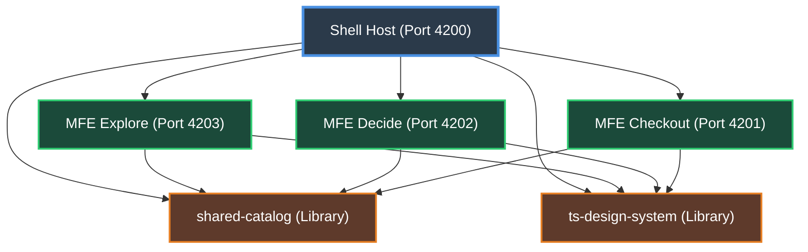

# 🚜 Arquitectura Monorepo del Tractor Store

Este documento contiene los detalles de la arquitectura física del **Tractor Store**, incluyendo la distribución de puertos, dependencias, flujo de ejecución y validaciones necesarias para superar el **Hito de la Fase 3**.

---

## 🗺️ 1. Arquitectura de Módulos y Puertos

En nuestra arquitectura de micro-frontends (MFE), cada dominio de negocio está asignado a un equipo autónomo que opera una aplicación independiente. El monorepo organiza esta estructura de forma que todos los componentes arranquen de forma nativa en puertos dedicados libres de conflictos.

### Tabla de Puertos y Proyectos

| Proyecto | Carpeta Física | Puerto | Tipo (Tag Nx) | Rol del Proyecto |
| :--- | :--- | :--- | :--- | :--- |
| **`shell`** | `apps/shell` | `4200` | `type:shell` | Host unificado (Orquestador central) |
| **`mfe-checkout`** | `packages/mfe-checkout` | `4201` | `type:mfe` | Micro-frontend del Carrito y Transacciones |
| **`mfe-decide`** | `packages/mfe-decide` | `4202` | `type:mfe` | Micro-frontend de Detalle de Productos |
| **`mfe-explore`** | `packages/mfe-explore` | `4203` | `type:mfe` | Micro-frontend de Catálogo y Búsqueda |
| **`elements-lab`** | `playground/elements-lab` | `4204` | *Ninguno* | Laboratorio experimental de Angular Elements |
| **`shared-catalog`** | `packages/shared-catalog` | *N/A* | `type:shared` | Librería compartida de Modelos y Eventos |
| **`ts-design-system`** | `packages/ts-design-system`| *N/A* | `type:shared` | Librería de Componentes Visuales Angular |

---

## 📊 2. Grafo de Dependencias del Tractor Store

El siguiente diagrama visualiza cómo fluye la arquitectura y el control de dependencias entre los diferentes proyectos del monorepo:



### Reglas Críticas de Aislamiento (Tags):
*   Los micro-frontends (`mfe-explore`, `mfe-decide`, `mfe-checkout`) tienen **totalmente prohibido** importarse código mutuamente. Deben ser 100% acoplados y autónomos.
*   Las librerías compartidas (`shared-catalog`, `ts-design-system`) tienen **totalmente prohibido** depender de cualquier micro-frontend o de la aplicación `shell`.
*   El linter verifica esto automáticamente gracias a la regla `@nx/enforce-module-boundaries` en nuestro archivo `eslint.config.mjs`.

---

## 🚀 3. Guía de Ejecución Local

Para controlar y validar tu entorno de desarrollo, utiliza los siguientes comandos (asegúrate de que NVM y tu Node local estén correctamente cargados en tu consola):

> [!NOTE]
> Para ejecutar estos comandos de forma óptima en tu consola local, recuerda cargar primero NVM en caso de que utilices un Node manejado por este gestor.

### A. Levantar las Aplicaciones en Paralelo
Para levantar las 4 aplicaciones de Angular simultáneamente en sus puertos específicos (y tu playground sin conflictos):
```bash
pnpm exec nx run-many --target=serve --all
```
*   *Nx* arrancará en paralelo el servidor de desarrollo para `shell`, `mfe-checkout`, `mfe-decide`, `mfe-explore` y `elements-lab`.
*   Podrás abrir tu navegador en:
    *   Shell: `http://localhost:4200`
    *   MFE Checkout: `http://localhost:4201`
    *   MFE Decide: `http://localhost:4202`
    *   MFE Explore: `http://localhost:4203`
    *   Elements Lab: `http://localhost:4204`

### B. Validar Límites Arquitectónicos (Lint)
Para asegurarte de que ningún linter o regla de frontera se ha roto en el monorepo entero:
```bash
pnpm exec nx run-many --target=lint --skip-nx-cache
```

### C. Visualizar Grafo de Dependencias
Para explorar de forma interactiva y visual el mapa de tus dependencias:
```bash
pnpm exec nx graph
```

---

## ✅ 4. Checklist para Avanzar

Antes de pasar a la **Fase 4 (Module Federation)**, asegúrate de poder responder con seguridad y total conocimiento a las siguientes preguntas teóricas del reto:

1.  **¿Qué hace `nx affected` y por qué ahorra tiempo en CI?**
    *   *Respuesta:* `nx affected` compara tu rama actual de Git con una rama base (normalmente `main` o `master`). Identifica cuáles archivos cambiaron, detecta cuáles proyectos del monorepo se vieron afectados por esos cambios mediante el dependency graph, y **únicamente ejecuta tareas (builds, tests, lints) en esos proyectos específicos**, omitiendo el código sin cambios. Esto reduce el consumo de tiempo en pipelines de CI de horas a minutos.
2.  **¿Qué son los `namedInputs` y cómo declaran qué archivos invalidan la caché?**
    *   *Respuesta:* `namedInputs` en `nx.json` agrupan conjuntos de archivos (ej. código de producción, tests, documentación). Nos permiten configurar en `targetDefaults` exactamente qué archivos participan en el cálculo del hash para la caché de una tarea. Por ejemplo, al excluir `!{projectRoot}/**/*.spec.ts` de las entradas del target `build`, garantizamos que cambiar un archivo de test no obligue a reconstruir el paquete final de producción, optimizando la tasa de aciertos de la caché.
3.  **¿Cuál es la diferencia entre usar `pnpm link` local / workspaces y publicación tradicional?**
    *   *Respuesta:* La publicación tradicional exige compilar la librería, subirla a un registro corporativo (Nexus/npm) incrementando su versión, y reinstalarla en la aplicación de destino. Esto destruye el flujo de desarrollo local. Los workspaces de pnpm utilizan enlaces simbólicos (Symlinks) a nivel del sistema operativo. La aplicación consume directamente los archivos fuente locales del paquete sin requerir publicación. Cualquier modificación en la librería compartida se refleja en tiempo real en la aplicación consumidora.
4.  **¿Cómo previenen las etiquetas (tags) dependencias arquitectónicamente incorrectas?**
    *   *Respuesta:* Asignando tags semánticos (como `type:shell`, `type:mfe`, `type:shared`) en `project.json` y acoplándolos con la regla `@nx/enforce-module-boundaries` de ESLint, definimos una matriz de restricciones. Si un desarrollador intenta hacer un import que viole las reglas (como importar `mfe-checkout` desde `mfe-explore`), el linter arrojará un error de compilación estática inmediata, bloqueando el commit de forma automatizada.
