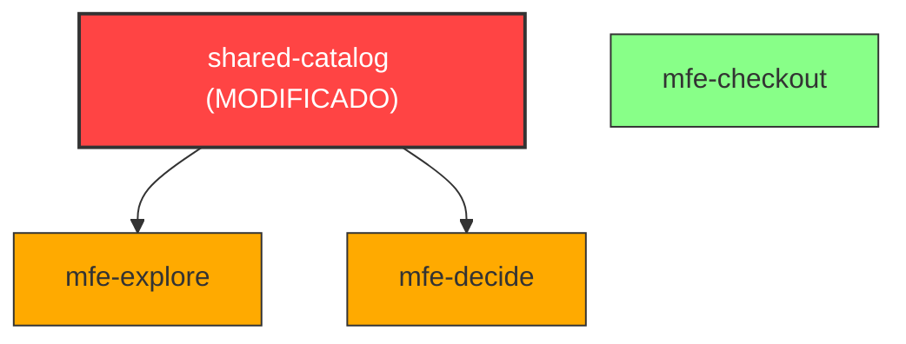

# ⚡ Guía de Aprendizaje: Nx Tooling y Optimización de Monorepos

Esta guía profundiza en el ecosistema de **Nx**, cubriendo sus motores de ejecución, generadores estandarizados, el funcionamiento detallado de la caché, algoritmos `affected`, límites arquitectónicos con tags, y la visualización de dependencias.

---

## 🏗️ 1. Ejecutores (Executors) y Generadores (Generators)

En Nx, el desarrollo se divide en dos grandes conceptos activos: **Ejecutar tareas** y **Crear código**.

### Ejecutores (Executors)
Un ejecutor es un módulo de software que le enseña a Nx cómo correr una tarea específica en un proyecto. Es la abstracción de tus scripts de construcción.
* En lugar de tener scripts ad-hoc como `webpack-dev-server --config...` en cada carpeta, el archivo `project.json` del proyecto delega en un ejecutor estandarizado:
  * Compilación Angular: `@angular/build:application`
  * Servidor de desarrollo: `@angular/build:dev-server`
  * Análisis estático: `@nx/eslint:lint`
* **Ventaja:** Homogeneiza cómo se ejecutan las herramientas en todo el monorepo. Todos los proyectos se compilan con `nx run <nombre>:build` sin importar si son React, Angular, NestJS o TypeScript puro.

### Generadores (Generators)
Un generador es una plantilla inteligente (Schematic) que automatiza la creación de aplicaciones, librerías, componentes o servicios con las reglas de estilo y arquitectura de la empresa.
* **Comando ejemplo:**
  ```bash
  pnpm exec nx g @nx/angular:app --directory=packages/mfe-checkout
  ```
* **Ventaja:** Garantiza consistencia absoluta. Cada nuevo componente o aplicación se crea con la configuración exacta de linter, estilos scss, TypeScript y rutas que la arquitectura demanda, evitando que los desarrolladores cometan errores manuales de configuración.

---

## ⚡ 2. Caching y targetDefaults: Optimización Extrema

Una de las características más potentes de Nx es que **nunca vuelve a compilar ni probar código que no ha cambiado**.

### targetDefaults (Configuración por Defecto)
Definido en `nx.json`, indica qué tareas son cacheables y qué dependencias tienen entre sí.
```json
"targetDefaults": {
  "@angular/build:application": {
    "cache": true,
    "dependsOn": ["^build"],
    "inputs": ["production", "^production"]
  }
}
```
* **`cache: true`:** Le dice a Nx que guarde el resultado físico de esta tarea. Si se repite con las mismas entradas, simplemente copia el resultado guardado de inmediato.
* **`dependsOn: ["^build"]`:** Indica que para compilar un proyecto, primero debe compilarse el build de todas sus dependencias internas (`^` significa dependencias directas).

### namedInputs (Entradas Nombradas)
Permite definir qué archivos exactos invalidan la caché. Excluimos archivos que no afectan el empaquetado final para evitar invalidaciones innecesarias:
```json
"namedInputs": {
  "production": [
    "default",
    "!{projectRoot}/.eslintrc.json",
    "!{projectRoot}/eslint.config.mjs",
    "!{projectRoot}/**/*.md",          // 📝 Modificar la documentación no recompila la app
    "!{projectRoot}/**/*.spec.ts"       // 🧪 Cambiar un test no invalida la caché del bundle de producción
  ]
}
```

### Caché Local vs. Caché Distribuida
* **Caché Local:** Guarda las salidas de compilación en el directorio `.nx/cache` de tu propia computadora. Ahorra tiempo individual.
* **Caché Distribuida:** Sube de forma segura los hashes y resultados de compilación a un servidor compartido (ej. **Nx Cloud** o un bucket S3 de almacenamiento).
  * **El impacto:** Si tu compañero de equipo compiló la rama `main` hace 5 minutos, o si el servidor de CI/CD ya la compiló para validar una Pull Request, cuando tú hagas `git pull` y compiles localmente, **el build tardará 0 segundos**, ya que Nx descargará el binario precompilado de forma transparente.

---

## 🌿 3. nx affected: Velocidad en CI/CD

En un monorepo corporativo con 50 aplicaciones y 200 librerías compartidas, correr todos los tests y builds en cada Pull Request tomaría horas y dispararía los costos de nube.

**Nx solve esto con el comando `affected`:**



* Si modificas únicamente `packages/shared-catalog`:
  * Nx analiza el historial de Git: `git diff --name-only <commit_base> <commit_actual>`.
  * Determina que `shared-catalog` cambió.
  * Sigue el grafo de dependencias hacia arriba: descubre que `mfe-explore` y `mfe-decide` dependen de `shared-catalog`, pero `mfe-checkout` no.
  * **La ejecución:**
    ```bash
    pnpm exec nx affected --target=build --base=origin/main
    ```
    Solo compilará `shared-catalog`, `mfe-explore` y `mfe-decide`. `mfe-checkout` y `shell` se omiten por completo, ahorrando hasta un 80% del tiempo de compilación en CI/CD.

---

## 🛡️ 4. Tags de Proyecto y Control Arquitectónico

A medida que más desarrolladores entran al monorepo, corremos el riesgo de que violen la arquitectura limpia. Por ejemplo, que un desarrollador de `mfe-explore` importe componentes directamente de `mfe-checkout` para ahorrar tiempo, acoplando fuertemente los dos módulos.

Nx evita esto mediante **etiquetas de proyecto (tags)** combinadas con reglas estrictas de linter.

### Configuración en `project.json`
Asignamos etiquetas semánticas a cada módulo del monorepo:
* **Shell App:** `"tags": ["type:shell"]`
* **Micro-Frontends:** `"tags": ["type:mfe"]`
* **Librerías compartidas:** `"tags": ["type:shared"]`

### Reglas de Validación en `eslint.config.mjs`
Configuramos la regla `@nx/enforce-module-boundaries` para prohibir dependencias incorrectas:
```javascript
depConstraints: [
  {
    sourceTag: 'type:shell',
    onlyDependOnLibsWithTags: ['type:mfe', 'type:shared'],
  },
  {
    sourceTag: 'type:mfe',
    onlyDependOnLibsWithTags: ['type:shared'], // 🚫 Prohibido depender de otros MFEs
  },
  {
    sourceTag: 'type:shared',
    onlyDependOnLibsWithTags: ['type:shared'], // 🚫 Prohibido depender de MFEs o Shell
  }
]
```

> [!TIP]
> Si intentas escribir `import { CheckoutButton } from '../../mfe-checkout/...'` dentro del código de `mfe-explore`, **el linter marcará un error rojo en tu editor inmediatamente** y el commit fallará en CI/CD, garantizando que nadie rompa la estructura arquitectónica.

---

## 📊 5. Visualización del Dependency Graph

Auditar un monorepo complejo de forma visual es sumamente sencillo en Nx.

```bash
pnpm exec nx graph
```

Este comando levanta un servidor web local interactivo que renderiza el **Grafo de Dependencias** del proyecto en tiempo real.
* Te permite filtrar proyectos.
* Visualizar caminos críticos de acoplamiento.
* Rastrear por qué una app se compila cuando cambia cierto archivo.
* Auditar visualmente el cumplimiento de tus etiquetas de arquitectura.
