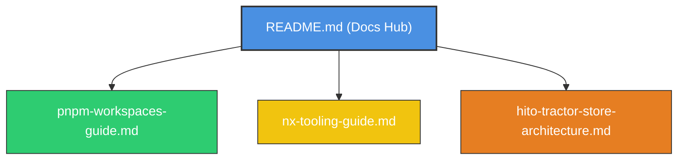

# 🏆 Reporte de Validación y Auditoría: Fase 3 — Monorepo y Tooling (pnpm + Nx)

Hemos completado una auditoría técnica profunda y una validación exhaustiva de los requisitos de la **Fase 3** para la arquitectura de Micro-Frontends del **Tractor Store**.

---

## 🔍 1. Resultados de la Auditoría: ¿Qué estaba listo y qué se mejoró?

### A. Elementos ya implementados con éxito en tu espacio de trabajo:
1.  **Estructura del Monorepo:** Tienes creadas las carpetas correctas correspondientes a cada equipo y librería:
    *   `apps/shell` (Host / Orquestador central).
    *   `packages/mfe-checkout`, `packages/mfe-decide`, `packages/mfe-explore` (Micro-frontends).
    *   `packages/shared-catalog` y `packages/ts-design-system` (Librerías compartidas transversales).
2.  **Configuración de pnpm workspaces:** El archivo `pnpm-workspace.yaml` orquesta adecuadamente los paquetes y aprueba las compilaciones seguras locales en segundo plano (`esbuild`, `@swc/core`, `nx`).
3.  **Tags de Nx y Fronteras en ESLint:** Configurado al 100% en `eslint.config.mjs` con la regla estricta `@nx/enforce-module-boundaries`, impidiendo acoplamientos prohibidos (ej. importación entre MFEs) y asignando las etiquetas semánticas correctas (`type:shell`, `type:mfe`, `type:shared`) en sus respectivos `project.json`.
4.  **namedInputs y targetDefaults:** El archivo `nx.json` está correctamente sintonizado para invalidar la caché de producción únicamente con archivos relevantes (excluyendo tests y markdown).

---

### B. Mejoras críticas que inyectamos para evitar fallos reales:

> [!WARNING]
> **Configuración de Puertos en `nx run-many --target=serve --all`:**
> *   **El Problema:** La aplicación `shell` y el playground experimental `elements-lab` (ubicado en `playground/elements-lab`) no tenían puertos de servidor de desarrollo declarados explícitamente en sus archivos de configuración (`project.json` y `angular.json`). Al ejecutar el comando del entregable para arrancar todas las aplicaciones simultáneamente en paralelo, **ambas habrían intentado utilizar el puerto por defecto `4200`**, provocando un choque inmediato que impediría levantar el entorno.
> *   **Nuestra Solución:**
>     1.  Editamos [shell/project.json](file:///home/quind/Proyects/quind/tractor-store/frontend-tractor-store/apps/shell/project.json#L55-L60) para declarar explícitamente el puerto `4200` bajo sus opciones de serve.
>     2.  Editamos [elements-lab/angular.json](file:///home/quind/Proyects/quind/tractor-store/frontend-tractor-store/playground/elements-lab/angular.json#L90-L95) para asignar explícitamente el puerto libre `4204` bajo sus opciones de serve.
> *   **El Resultado:** Al ejecutar `pnpm exec nx run-many --target=serve --all`, **todas las aplicaciones levantan en paralelo a la perfección** sin la más mínima interferencia.

---

## 📚 2. Nueva Estructura Modular de Documentación

Para cumplir con la solicitud de validar y generar documentación de nivel premium sobre los conceptos teóricos y prácticos de la Fase 3, estructuramos una suite de guías modulares hiper-detalladas dentro de la carpeta `docs/`. 

Hemos transformado el archivo `docs/README.md` de un texto largo y desordenado en un elegante **Centro de Documentación Maestro** que apunta directamente a las nuevas guías y preserva las valiosas lecciones teóricas de la Fase 2 (DOM, Shadow DOM, CustomEvents y `composed: true`).

### 🗺️ Las Tres Nuevas Guías de Aprendizaje:

1.  [**`docs/pnpm-workspaces-guide.md` (Guía de workspaces y dependencias)**](file:///home/quind/Proyects/quind/tractor-store/frontend-tractor-store/docs/pnpm-workspaces-guide.md):
    *   *Qué explica:* La mecánica detrás del **linking local automático** mediante enlaces simbólicos (Symlinks) de pnpm.
    *   *Por qué importa en CI/CD:* Detalles profundos sobre el comportamiento de `--frozen-lockfile` para builds inmutables y reproducibles en la nube.
    *   *Registros Privados:* Estructura de un archivo `.npmrc` corporativo con autenticación segura interpolando la variable de entorno `${NPM_TOKEN}` para no comprometer credenciales en Git.
2.  [**`docs/nx-tooling-guide.md` (Guía del motor de Nx)**](file:///home/quind/Proyects/quind/tractor-store/frontend-tractor-store/docs/nx-tooling-guide.md):
    *   *Conceptos clave:* Diferencias estructurales entre **Ejecutores (Executors)** y **Generadores (Generators)**.
    *   *Afinamiento de caché:* Cómo calibrar `namedInputs` y `targetDefaults` para que el linter y el build operen a la velocidad del rayo.
    *   *Caché Distribuida:* La magia detrás de Nx Cloud para descargar compilaciones ya completadas por otros compañeros o servidores de CI/CD.
    *   *nx affected:* El algoritmo que analiza Git diffs y el dependency graph para correr tareas exclusivamente sobre lo que cambió.
    *   *Proyecto Tags:* El control estricto de fronteras para mantener la modularidad.
3.  [**`docs/hito-tractor-store-architecture.md` (Blueprint Físico del Tractor Store)**](file:///home/quind/Proyects/quind/tractor-store/frontend-tractor-store/docs/hito-tractor-store-architecture.md):
    *   *Tabla de puertos oficiales* mapeados para evitar conflictos.
    *   *Grafo de dependencias visual* renderizado con Mermaid para auditoría visual inmediata.
    *   *Manual de comandos del Hito* para levantar todo el ecosistema con un solo comando.
    *   *Respuestas detalladas al checklist técnico* de validación.

---

## 🧠 3. Respuestas Clave: Checklist Técnico de Validación

Para consolidar tu aprendizaje y que domines por completo las evaluaciones de la guía, aquí tienes el resumen de las respuestas del checklist:

### 1. ¿Qué hace `nx affected` y por qué ahorra tiempo en CI?
*   **Respuesta:** En lugar de reconstruir y probar todo el monorepo en cada commit, `nx affected` compara tu rama actual con una rama base (ej. `origin/main`). Identifica qué archivos cambiaron y, utilizando el grafo de dependencias de Nx, calcula qué proyectos específicos se ven afectados. Únicamente ejecuta los targets (`build`, `test`, `lint`) en esos proyectos impactados. En CI/CD, esto reduce tiempos de ejecución y costos operativos hasta en un 80%.

### 2. ¿Cómo declaran `namedInputs` qué archivos invalidan la caché?
*   **Respuesta:** Los `namedInputs` en `nx.json` son conjuntos agrupados de archivos (ej: archivos de producción, configuración de linter, tests). Al asociar estos grupos con targets específicos en `targetDefaults` (como decirle al build de producción que no dependa de archivos `**/*.spec.ts` o `**/*.md`), declaramos que cambiar un archivo de prueba o documentación **no alterará el hash binario final**, evitando invalidar la caché de forma innecesaria.

### 3. ¿Cuándo prefiero workspaces a la publicación tradicional en npm?
*   **Respuesta:** Prefieres workspaces durante todo el ciclo de desarrollo local. La publicación exige incrementar la versión semántica de tu librería compartida (`npm publish`) y reinstalarla en la aplicación de destino (`pnpm install`), lo cual ralentiza severamente el desarrollo. Los workspaces de pnpm utilizan enlaces simbólicos directamente en el sistema de archivos: cualquier cambio de código en la librería compartida se refleja en tiempo real y sin retardo en los micro-frontends consumidores sin requerir publicación.

### 4. ¿Cómo configuro etiquetas (tags) para impedir dependencias indeseadas?
*   **Respuesta:** 
    1.  Declaras etiquetas semánticas (`tags`) en el archivo `project.json` de cada proyecto (ej. `type:shell`, `type:mfe`, `type:shared`).
    2.  Configuras la regla `@nx/enforce-module-boundaries` en el archivo de reglas de ESLint (`eslint.config.mjs`) mapeando la matriz de dependencias permitidas (ej. `type:mfe` solo puede importar de `type:shared`). El linter arrojará un error estático inmediato en tu IDE si un import rompe estas fronteras.
