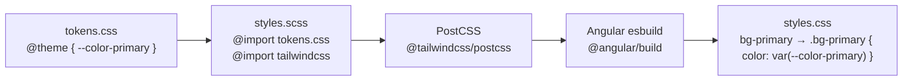

# 🎨 Guía de Tailwind CSS v4 en el Monorepo Tractor Store

Esta guía documenta **por qué** se eligió Tailwind CSS v4, **cómo** se integra con Angular 21 y el monorepo de pnpm + Nx, y **qué decisiones de arquitectura** se tomaron durante el proceso.

---

## ⚡ 1. Tailwind CSS v4: Qué cambió y por qué importa

Tailwind v4 (publicado en 2025) es una **reescritura completa** del framework. Los cambios que nos afectan directamente en este stack son:

### Cambios críticos de v3 → v4

| Aspecto | Tailwind v3 | Tailwind v4 |
|---|---|---|
| **Configuración** | `tailwind.config.js` (JavaScript) | `@theme {}` en CSS nativo |
| **Plugin PostCSS** | `require('tailwindcss')` | `require('@tailwindcss/postcss')` ← paquete separado |
| **Import en CSS** | `@tailwind base/components/utilities` | `@import "tailwindcss"` |
| **Tokens de diseño** | `theme.extend.colors` en JS | Variables CSS en `@theme {}` |
| **Motor interno** | Rust (Lightning CSS) | Rust + nuevas optimizaciones |

> [!IMPORTANT]
> En Tailwind v4, el plugin de PostCSS fue extraído a un paquete independiente `@tailwindcss/postcss`. Si intentas usar `tailwindcss` directamente como plugin PostCSS obtendrás el error:
> `Error: The PostCSS plugin has moved to a separate package`

---

## 🏗️ 2. Arquitectura de la Configuración CSS

En lugar de tener un archivo JavaScript de configuración, toda la customización vive en CSS. Nuestra arquitectura de estilos para el Tractor Store sigue esta jerarquía:

```
packages/design-tokens/src/tokens.css   ← La "Fuente de la Verdad"
        ↓ se importa en
apps/shell/src/styles.scss               ← Estilos globales del Shell
        ↓ alimenta a
apps/shell/tailwind.config.js            ← Configuración legacy (solo contenido)
```

### Flujo de procesamiento de estilos



---

## 📦 3. Paquetes Instalados y su Rol

```bash
# Instalados como dependencias de desarrollo en la RAÍZ del workspace (-w)
pnpm add -D -w tailwindcss postcss autoprefixer @tailwindcss/postcss
```

| Paquete | Versión | Rol |
|---|---|---|
| `tailwindcss` | `4.3.0` | Motor principal — genera las utilidades CSS |
| `@tailwindcss/postcss` | `4.3.0` | Plugin PostCSS para Angular/webpack (separado en v4) |
| `postcss` | `8.x` | Procesador CSS — ejecuta los plugins |
| `autoprefixer` | `10.x` | Añade prefijos de vendor (-webkit, -moz) automáticamente |

---

## ⚙️ 4. Configuración de PostCSS: `postcss.config.json`

Angular's builder (`@angular/build`, basado en esbuild) detecta automáticamente el archivo `postcss.config.json` en la **raíz del workspace**. 

> [!WARNING]
> Angular ignora `postcss.config.js` (JavaScript). Solo lee `postcss.config.json` de forma confiable cuando se usa el builder moderno de esbuild.

```json
// postcss.config.json (raíz del workspace)
{
  "plugins": {
    "@tailwindcss/postcss": {}
  }
}
```

**¿Por qué en la raíz y no en `apps/shell/`?**  
Porque todos los micro-frontends del monorepo necesitarán Tailwind en el futuro (`mfe-explore`, `mfe-decide`, `mfe-checkout`). Al colocarlo en la raíz, Angular lo detecta automáticamente para cada aplicación sin tener que duplicar la configuración.

---

## 🎨 5. Design Tokens con `@theme {}`: La Fuente de la Verdad

La directiva `@theme {}` es la característica más poderosa de Tailwind v4. Cuando declaras una variable CSS dentro de ella, **Tailwind genera automáticamente las utilidades correspondientes**:

```css
/* packages/design-tokens/src/tokens.css */
@theme {
  /* Tailwind genera: bg-primary, text-primary, border-primary, ring-primary... */
  --color-primary: #22c55e;

  /* Tailwind genera: font-base */
  --font-family-base: 'Raleway', sans-serif;

  /* Tailwind genera: p-container, m-container, gap-container... */
  --spacing-container: 2rem;
}
```

### Convención de Nombres en `@theme`

Tailwind v4 sigue un mapeo de nombres predecible:

| Prefijo de la variable CSS | Utilidades generadas |
|---|---|
| `--color-*` | `bg-*`, `text-*`, `border-*`, `ring-*`, `shadow-*`... |
| `--font-family-*` | `font-*` |
| `--spacing-*` | `p-*`, `m-*`, `gap-*`, `w-*`, `h-*`... |
| `--border-radius-*` | `rounded-*` |
| `--font-size-*` | `text-*` |

---

## 🗂️ 6. Estructura de Archivos CSS del Proyecto

```
frontend-tractor-store/
├── postcss.config.json              # Plugin PostCSS global (raíz del workspace)
├── tailwind-workspace-preset.js     # Preset compartido (tokens → Tailwind v3 compat)
├── packages/
│   └── design-tokens/
│       └── src/
│           └── tokens.css           # 🏆 La Fuente de la Verdad (Design Tokens)
│               ├── @import url(Google Fonts)
│               ├── @theme { ... }   # Tokens mapeados a utilidades de Tailwind
│               └── :root { ... }    # Variables CSS tradicionales
└── apps/
    └── shell/
        ├── tailwind.config.js       # Configuración de contenido (qué archivos escanear)
        ├── postcss.config.js        # PostCSS local (referencia histórica)
        └── src/
            └── styles.scss          # Importación de tokens + tailwindcss
```

---

## 🛠️ 7. Configuración del Editor: VS Code

La directiva `@theme` es específica de Tailwind v4 y no forma parte del estándar CSS del W3C. VS Code la marcará con el warning `Unknown at rule @theme` a menos que se configure correctamente:

### `.vscode/settings.json`

```json
{
  // Desactiva el validador nativo (no conoce @theme, @utility, @apply)
  "css.validate": false,
  "scss.validate": false
}
```

### `.vscode/extensions.json`

```json
{
  "recommendations": [
    "bradlc.vscode-tailwindcss"  // IntelliSense oficial de Tailwind
  ]
}
```

> [!TIP]
> La extensión **Tailwind CSS IntelliSense** (`bradlc.vscode-tailwindcss`) reemplaza al validador nativo de VS Code y añade:
> - Autocompletado de clases de Tailwind en HTML y TypeScript
> - Reconocimiento de `@theme`, `@utility`, `@apply`, `@source`
> - Preview de colores en línea

---

## ❓ 8. FAQ: Preguntas Frecuentes

**¿Necesito `tailwind.config.js` en Tailwind v4?**
No es estrictamente necesario para el tema (ahora vive en `@theme {}`). Sin embargo, en Angular con Nx todavía es útil para la opción `content` (qué archivos escanea Tailwind) y para usar `createGlobPatternsForDependencies` de `@nx/angular/tailwind`.

**¿Por qué `@import "tailwindcss"` y no `@tailwind base/components/utilities`?**
En Tailwind v4, la directiva `@tailwind` está deprecada. El nuevo punto de entrada es `@import "tailwindcss"`, que incluye todo en una sola línea.

**¿Puedo seguir usando clases de Tailwind v3 como `flex-grow`?**
Algunas clases fueron renombradas en v4 (ej: `flex-grow` → `grow`). Es un cambio pequeño pero importante al migrar. Tailwind publica una [guía de migración oficial](https://tailwindcss.com/docs/upgrade-guide).

**¿El archivo `tailwind-workspace-preset.js` sigue siendo necesario?**
Con Tailwind v4 su función (extender el tema) fue absorbida por `@theme {}` en `tokens.css`. Por el momento sirve como capa de compatibilidad pero puede eliminarse en una futura limpieza.
